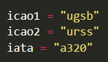
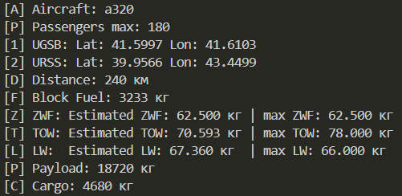

## Example of Work
ㅤㅤㅤㅤㅤㅤㅤ
ㅤㅤㅤㅤ

## How to View the Code?

This project is private. For additional information, contact @xAvakov via Telegram.

## Can You Help?

If you wish to help improve the code, you can do so by contacting @xAvakov via Telegram.

## Note

Description of the files and the files themselves are only in a private copy

The code is in the development stage and has inaccuracies in mathematical calculations.

The closed project uses the `MIT` license.

The PROGRAM is not intended for pilots and aviation specialists; the code is made for aviation enthusiasts.

#

## Пример работы
ㅤㅤㅤㅤㅤㅤㅤ
ㅤㅤㅤㅤ

## Как посмотреть код?

Этот проект находится в закрытом доступе, для дополнительной информации связавшись с @xAvakov через Telegram

## Можешь помочь?

Если у вас есть желание помочь улучшить код, вы можете сделать это, связавшись с @xAvakov через Telegram

## Примечание

Описание файлов и сами файлы только в закрытой копии

Код в стадии разработки и имеет погрешности в математических расчётах.

Закртый проект использует лицензию `MIT` 

ПРОГРАММА никак не предназначенна для пилотов и специалистов в области авиации, код сделан для авиационных энтузиастов.
